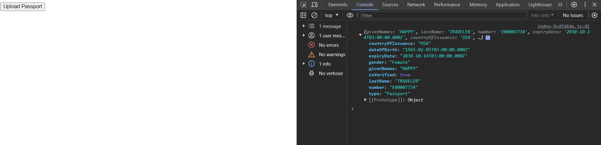
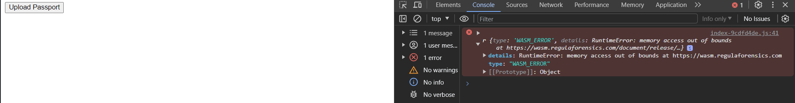

# Setup

First create a `.env` file and set the `VITE_LICENSE_KEY` to some valid private key.

Then, install dependencies:

```sh
npm install
```

Then compile and run:

```sh
npm run build && npm run preview
```

The app will be available at: [https://localhost:4173/](https://localhost:4173/)

# Reproduction Steps

There are two passports under `./passports`:

1. `big.jpg`
2. `small.jpg`

They are the very same passport, where one is a scaled down version of the other.

When uploading `small.jpg`, passport scanning works as expected:



However, when uploading `big.jpg`, we get the WASM error:


